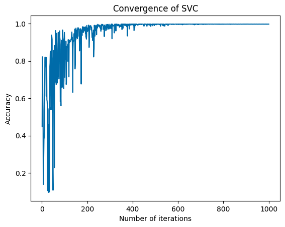

# parameter-optimisation-ucs654

**Dataset Used:** [Skin Segmentation](https://archive.ics.uci.edu/ml/datasets/skin+segmentation)

| Number of Instances:  | 245057 |
|-----------------------|--------|
| Number of Attributes: | 4      |

---

### Results:
 
 | Sample # | Best Accuracy | kernel | c   | gamma |
|----------|---------------|--------|-----|-------|
| 1        | 0.9982        | rbf    | 100 | 0.1   |
| 2        | 0.9974        | rbf    | 100 | 0.1   |
| 3        | 0.9985        | rbf    | 100 | 0.1   |
| 4        | 0.9979        | rbf    | 100 | 0.1   |
| 5        | 0.9982        | rbf    | 100 | 0.1   |
| 6        | 0.9974        | rbf    | 100 | 0.1   |
| 7        | 0.9979        | rbf    | 100 | 0.1   |
| 8        | 0.9980        | rbf    | 100 | 0.1   |
| 9        | 0.9980        | rbf    | 100 | 0.1   |
| 10       | 0.9975        | rbf    | 100 | 0.1   |

### Convergence graph for the above result:

